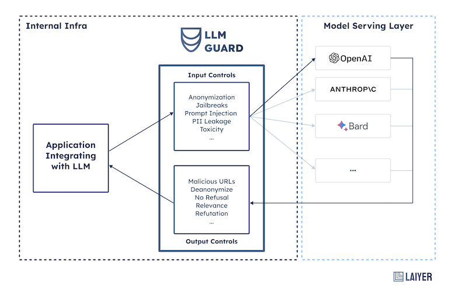

# LLM Guard - The Security Toolkit for LLM Interactions

LLM Guard by [Laiyer.ai](https://laiyer.ai) is a comprehensive tool designed to fortify the security of Large Language Models (LLMs).

[**Playground**](https://huggingface.co/spaces/laiyer/llm-guard-playground) | [**Changelog**](./changelog.md) | [**Blog**](https://substack.com/@laiyer) | [**Slack**](https://join.slack.com/t/laiyerai/shared_invite/zt-28jv3ci39-sVxXrLs3rQdaN3mIl9IT~w)

## What is LLM Guard?



By offering sanitization, detection of harmful language, prevention of data leakage, and resistance against prompt
injection attacks, LLM-Guard ensures that your interactions with LLMs remain safe and secure.

## Installation

Begin your journey with LLM Guard by downloading the package:

```sh
pip install llm-guard
```

## Getting Started

**Important Notes**:

- LLM Guard is designed for easy integration and deployment in production environments. While it's ready to use
  out-of-the-box, please be informed that we're constantly improving and updating the repository.
- Base functionality requires a limited number of libraries. As you explore more advanced features, necessary libraries
  will be automatically installed.
- Ensure you're using Python version 3.9 or higher. Confirm with: `python --version`.
- Library installation issues? Consider upgrading pip: `python -m pip install --upgrade pip`.

**Examples**:

- Get started with [ChatGPT and LLM Guard](https://github.com/laiyer-ai/llm-guard/blob/main/examples/openai_api.py).

## Roadmap

### General

- [ ] Extend language support to cover popular and emerging languages, prioritize based on community feedback.
- [ ] Allow comparison of multiple outputs to facilitate better analysis and choice.
- [ ] Enable scanning of logits to support streaming mode.
- [ ] Expand examples and integrations, ensuring they cover common use-cases and are easy to follow.

### Prompt Scanners

- [ ] Utilize expressions for code detection to reduce dependency on models, improving speed and reliability.
- [ ] Support a variety of token calculators to offer more flexibility and compatibility.

### Output Scanners

- [ ] Scan for vulnerable libraries and provide recommendations for safer alternatives.
- [ ] Check for license compliance to ensure legal integrity.
- [ ] Detect insecure code patterns.
- [ ] Identify potential SQL injection points to enhance security.
- [ ] Verify links and provide options for whitelisting or blacklisting to maintain the quality of references.

## Community, Contributing, Docs & Support

LLM Guard is an open source solution.
We are committed to a transparent development process and highly appreciate any contributions.
Whether you are helping us fix bugs, propose new features, improve our documentation or spread the word,
we would love to have you as part of our community.

- Give us a ⭐️ github star ⭐️ on the top of this page to support what we're doing,
  it means a lot for open source projects!
- Read our
  [docs](https://laiyer-ai.github.io/llm-guard/)
  for more info about how to use and customize deepchecks, and for step-by-step tutorials.
- Post a [Github
  Issue](https://github.com/laiyer-ai/llm-guard/issues) to submit a bug report, feature request, or suggest an improvement.
- To contribute to the package, check out our [contribution guidelines](https://github.com/laiyer-ai/llm-guard/blob/main/CONTRIBUTING.md), and open a PR.

Join our Slack to give us feedback, connect with the maintainers and fellow users, ask questions,
get help for package usage or contributions, or engage in discussions about LLM security!

<a href="https://join.slack.com/t/laiyerai/shared_invite/zt-28jv3ci39-sVxXrLs3rQdaN3mIl9IT~w"></a>

## Supporters

LLM Guard is supported by the following organizations:

- [Google Patch Rewards program](https://bughunters.google.com/open-source-security/patch-rewards)
- [JetBrains](https://jb.gg/OpenSourceSupport)
